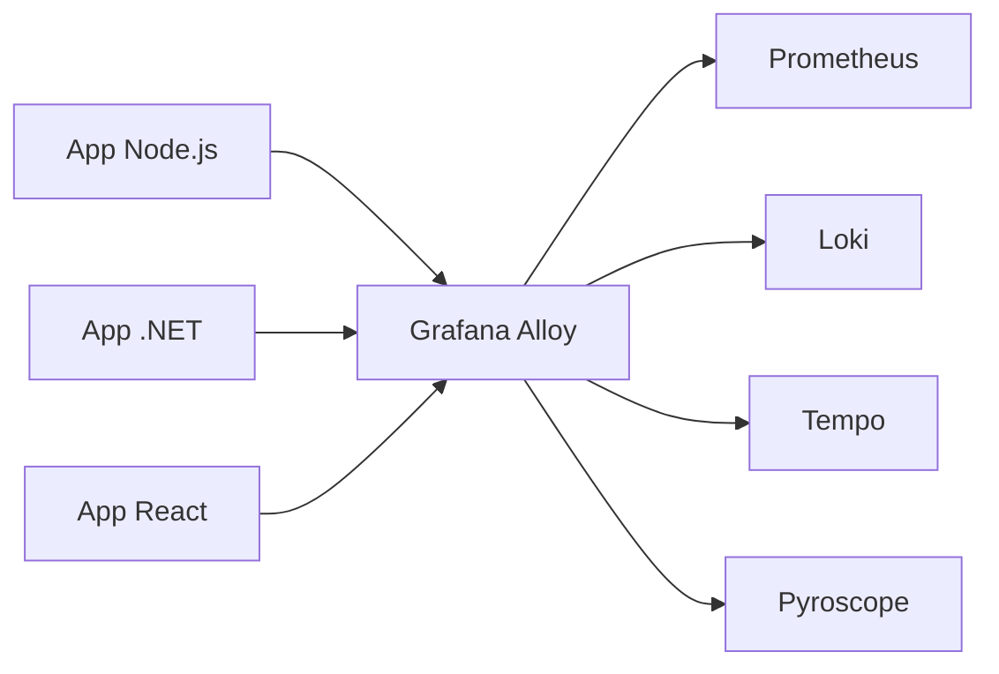

# 🌐 OpenTelemetry + Grafana Alloy - Guia Multi-Stack

> **Implementação rápida de observabilidade com Node.js, .NET e React**

---

## 📋 **Arquitetura Base**



**Alloy recebe**: Métricas, Logs, Traces e Profiling
**Alloy envia**: Para backends Grafana (Prometheus/Loki/Tempo/Pyroscope)

## 🔧 **Configuração de Ambiente**

### **📄 Variáveis de Ambiente (.env)**
```bash
# OpenTelemetry Configuration
OTEL_SERVICE_NAME=my-service
OTEL_SERVICE_VERSION=1.0.0
OTEL_ENVIRONMENT=development
OTEL_RESOURCE_ATTRIBUTES=service.name=${OTEL_SERVICE_NAME},service.version=${OTEL_SERVICE_VERSION},deployment.environment=${OTEL_ENVIRONMENT}

# Alloy/Collector Endpoints
OTEL_EXPORTER_OTLP_ENDPOINT=http://localhost:4318
OTEL_EXPORTER_OTLP_TRACES_ENDPOINT=${OTEL_EXPORTER_OTLP_ENDPOINT}/v1/traces
OTEL_EXPORTER_OTLP_METRICS_ENDPOINT=${OTEL_EXPORTER_OTLP_ENDPOINT}/v1/metrics
OTEL_EXPORTER_OTLP_LOGS_ENDPOINT=${OTEL_EXPORTER_OTLP_ENDPOINT}/v1/logs

# Para ambientes Docker
OTEL_EXPORTER_OTLP_ENDPOINT_DOCKER=http://alloy:4318
OTEL_EXPORTER_OTLP_TRACES_ENDPOINT_DOCKER=${OTEL_EXPORTER_OTLP_ENDPOINT_DOCKER}/v1/traces
OTEL_EXPORTER_OTLP_METRICS_ENDPOINT_DOCKER=${OTEL_EXPORTER_OTLP_ENDPOINT_DOCKER}/v1/metrics
OTEL_EXPORTER_OTLP_LOGS_ENDPOINT_DOCKER=${OTEL_EXPORTER_OTLP_ENDPOINT_DOCKER}/v1/logs

# Headers (opcional)
OTEL_EXPORTER_OTLP_HEADERS=api-key=your-api-key
OTEL_EXPORTER_OTLP_TIMEOUT=10000

# Sampling (opcional)
OTEL_TRACES_SAMPLER=traceidratio
OTEL_TRACES_SAMPLER_ARG=1.0

# Logs (opcional)
OTEL_LOGS_EXPORTER=otlp
OTEL_LOGS_PROCESSOR=batch
```

---

## 🟢 **Node.js Backend**

### **📦 Instalação**
```bash
npm install @opentelemetry/api \
  @opentelemetry/auto-instrumentations-node \
  @opentelemetry/exporter-otlp-http \
  @opentelemetry/sdk-node
```

### **⚙️ Configuração (otel.js)**
```javascript
const { NodeSDK } = require('@opentelemetry/sdk-node');
const { getNodeAutoInstrumentations } = require('@opentelemetry/auto-instrumentations-node');
const { OTLPTraceExporter } = require('@opentelemetry/exporter-otlp-http');
const { OTLPMetricExporter } = require('@opentelemetry/exporter-otlp-http');
const { OTLPLogExporter } = require('@opentelemetry/exporter-otlp-http');

// Configuração flexível via environment
const getConfig = () => {
  // Detectar ambiente (local vs docker)
  const isDocker = process.env.NODE_ENV === 'docker' || process.env.DOCKER === 'true';
  
  return {
    serviceName: process.env.OTEL_SERVICE_NAME || 'my-node-service',
    serviceVersion: process.env.OTEL_SERVICE_VERSION || '1.0.0',
    environment: process.env.OTEL_ENVIRONMENT || process.env.NODE_ENV || 'development',
    
    // URLs baseadas no ambiente
    tracesEndpoint: process.env.OTEL_EXPORTER_OTLP_TRACES_ENDPOINT || 
                   (isDocker ? 'http://alloy:4318/v1/traces' : 'http://localhost:4318/v1/traces'),
    
    metricsEndpoint: process.env.OTEL_EXPORTER_OTLP_METRICS_ENDPOINT || 
                    (isDocker ? 'http://alloy:4318/v1/metrics' : 'http://localhost:4318/v1/metrics'),
    
    logsEndpoint: process.env.OTEL_EXPORTER_OTLP_LOGS_ENDPOINT || 
                 (isDocker ? 'http://alloy:4318/v1/logs' : 'http://localhost:4318/v1/logs'),
    
    // Headers opcionais
    headers: process.env.OTEL_EXPORTER_OTLP_HEADERS ? 
             Object.fromEntries(
               process.env.OTEL_EXPORTER_OTLP_HEADERS.split(',').map(h => h.split('='))
             ) : {},
    
    // Timeout
    timeoutMs: parseInt(process.env.OTEL_EXPORTER_OTLP_TIMEOUT) || 10000,
    
    // Sampling
    samplerType: process.env.OTEL_TRACES_SAMPLER || 'traceidratio',
    samplerRatio: parseFloat(process.env.OTEL_TRACES_SAMPLER_ARG) || 1.0
  };
};

const config = getConfig();

// Configuração do SDK
const sdk = new NodeSDK({
  serviceName: config.serviceName,
  serviceVersion: config.serviceVersion,
  
  resource: {
    attributes: {
      'service.name': config.serviceName,
      'service.version': config.serviceVersion,
      'deployment.environment': config.environment,
      'service.instance.id': process.env.HOSTNAME || require('os').hostname(),
      // Adicionar outros atributos do ambiente
      ...(process.env.OTEL_RESOURCE_ATTRIBUTES ? 
          Object.fromEntries(
            process.env.OTEL_RESOURCE_ATTRIBUTES.split(',').map(attr => attr.split('='))
          ) : {})
    }
  },
  
  // Exportadores para Alloy
  traceExporter: new OTLPTraceExporter({
    url: config.tracesEndpoint,
    headers: config.headers,
    timeoutMillis: config.timeoutMs,
  }),
  
  metricReader: new OTLPMetricExporter({
    url: config.metricsEndpoint,
    headers: config.headers,
    timeoutMillis: config.timeoutMs,
  }),
  
  logRecordProcessor: new OTLPLogExporter({
    url: config.logsEndpoint,
    headers: config.headers,
    timeoutMillis: config.timeoutMs,
  }),
  
  // Instrumentação automática
  instrumentations: [getNodeAutoInstrumentations({
    '@opentelemetry/instrumentation-express': {
      requestHook: (span, info) => {
        span.setAttributes({
          'user.id': info.request.user?.id,
          'request.size': info.request.headers['content-length'],
          'user.session': info.request.session?.id
        });
      }
    },
    '@opentelemetry/instrumentation-http': {
      requestHook: (span, request) => {
        span.setAttribute('http.user_agent', request.getHeader('user-agent'));
      }
    }
  })],
});

// Logging de configuração
console.log('🔭 OpenTelemetry Configuration:', {
  service: config.serviceName,
  version: config.serviceVersion,
  environment: config.environment,
  tracesEndpoint: config.tracesEndpoint,
  metricsEndpoint: config.metricsEndpoint,
  logsEndpoint: config.logsEndpoint
});

sdk.start();
console.log('✅ OpenTelemetry iniciado com sucesso');

// Para graceful shutdown
process.on('SIGTERM', () => {
  sdk.shutdown()
    .then(() => console.log('OpenTelemetry finalizado'))
    .catch((error) => console.log('Erro ao finalizar', error))
    .finally(() => process.exit(0));
});

// Exportar configuração para uso em outros módulos
module.exports = { config, sdk };
```

### **🚀 Uso na Aplicação (app.js)**
```javascript
// IMPORTANTE: importar otel.js ANTES de qualquer outro módulo
require('./otel');

const express = require('express');
const { trace, metrics } = require('@opentelemetry/api');

const app = express();
const tracer = trace.getTracer('my-node-service');
const meter = metrics.getMeter('my-node-service');

// Métricas customizadas
const requestCounter = meter.createCounter('http_requests_total', {
  description: 'Total de requests HTTP'
});

const taskCounter = meter.createCounter('tasks_total', {
  description: 'Total de tarefas processadas'
});

// Middleware para métricas
app.use((req, res, next) => {
  requestCounter.add(1, {
    method: req.method,
    route: req.route?.path || req.path
  });
  next();
});

// Rota com trace customizado
app.get('/api/users/:id', async (req, res) => {
  const span = tracer.startSpan('get_user');
  
  try {
    span.setAttributes({
      'user.id': req.params.id,
      'operation': 'get_user'
    });
    
    // Simular operação
    const user = await getUserFromDB(req.params.id);
    
    span.setStatus({ code: 1 }); // SUCCESS
    res.json(user);
    
  } catch (error) {
    span.recordException(error);
    span.setStatus({ code: 2, message: error.message }); // ERROR
    res.status(500).json({ error: error.message });
    
  } finally {
    span.end();
  }
});

// Rota que gera métrica de negócio
app.post('/api/tasks', (req, res) => {
  // Processo de criar tarefa...
  
  taskCounter.add(1, {
    status: 'created',
    user_id: req.body.userId
  });
  
  res.json({ success: true });
});

app.listen(3000, () => {
  console.log('🚀 Server rodando na porta 3000');
});
```

---

## 🔵 **.NET Backend**

### **📦 Instalação**

#### **Opção 1: Grafana OpenTelemetry Distribution (Recomendado)**
```bash
# Package oficial da Grafana (funciona com Grafana OSS e Grafana Cloud)
dotnet add package Grafana.OpenTelemetry

# Para testes locais (remover em produção)
dotnet add package OpenTelemetry.Exporter.Console
```

**✅ Funciona com:**
- 🏠 **Grafana OSS** (Open Source) - self-hosted
- ☁️ **Grafana Cloud** - SaaS managed
- 🔧 **Qualquer backend OTLP** - Jaeger, Zipkin, etc.

#### **Opção 2: Configuração Manual OpenTelemetry**
```xml
<PackageReference Include="OpenTelemetry" Version="1.7.0" />
<PackageReference Include="OpenTelemetry.Extensions.Hosting" Version="1.7.0" />
<PackageReference Include="OpenTelemetry.Instrumentation.AspNetCore" Version="1.7.1" />
<PackageReference Include="OpenTelemetry.Instrumentation.Http" Version="1.7.1" />
<PackageReference Include="OpenTelemetry.Instrumentation.EntityFrameworkCore" Version="1.0.0-beta.9" />
<PackageReference Include="OpenTelemetry.Exporter.OpenTelemetryProtocol" Version="1.7.0" />
```

### **⚙️ Configuração (Program.cs)**

#### **Opção 1: Usando Grafana Distribution - Grafana OSS**
```csharp
using OpenTelemetry;
using OpenTelemetry.Metrics;
using OpenTelemetry.Trace;
using Grafana.OpenTelemetry;

var builder = WebApplication.CreateBuilder(args);

// Configuração flexível via environment
var serviceName = Environment.GetEnvironmentVariable("OTEL_SERVICE_NAME") ?? "my-dotnet-service";
var serviceVersion = Environment.GetEnvironmentVariable("OTEL_SERVICE_VERSION") ?? "1.0.0";
var environment = Environment.GetEnvironmentVariable("OTEL_ENVIRONMENT") ?? 
                  Environment.GetEnvironmentVariable("ASPNETCORE_ENVIRONMENT") ?? "Development";

// Grafana Distribution - funciona com Grafana OSS e Cloud
builder.Services.AddOpenTelemetry()
    .UseGrafana()  // ✅ Detecta automaticamente o endpoint configurado
    .WithTracing(tracing => tracing
        .AddAspNetCoreInstrumentation()
        .AddHttpClientInstrumentation()
        .AddEntityFrameworkCoreInstrumentation())
    .WithMetrics(metrics => metrics
        .AddAspNetCoreInstrumentation()
        .AddHttpClientInstrumentation()
        .AddRuntimeInstrumentation()
        .AddProcessInstrumentation());

// Logs com Grafana Distribution
builder.Logging.AddOpenTelemetry(logging => logging.UseGrafana());

var app = builder.Build();
app.MapControllers();
app.Run();
```

#### **🏠 Para Grafana OSS (Self-Hosted)**
```bash
# Configuração para Grafana OSS com Alloy local
OTEL_SERVICE_NAME="minha-api" \
OTEL_SERVICE_VERSION="1.2.0" \
OTEL_ENVIRONMENT="development" \
OTEL_EXPORTER_OTLP_ENDPOINT="http://localhost:4318" \
OTEL_EXPORTER_OTLP_PROTOCOL="http/protobuf" \
OTEL_RESOURCE_ATTRIBUTES="service.namespace=ecommerce" \
dotnet run

# Ou apontando direto para Grafana OSS OTLP receiver
OTEL_EXPORTER_OTLP_ENDPOINT="http://your-grafana-oss:4318" \
dotnet run
```

#### **☁️ Para Grafana Cloud (SaaS)**
```bash
# Configuração para Grafana Cloud com autenticação
OTEL_SERVICE_NAME="minha-api" \
OTEL_EXPORTER_OTLP_ENDPOINT="https://otlp-gateway-prod-us-east-0.grafana.net/otlp" \
OTEL_EXPORTER_OTLP_HEADERS="Authorization=Basic <base64-encoded-credentials>" \
dotnet run
```

#### **Opção 2: Configuração Manual (Controle Total)**
```csharp
using OpenTelemetry;
using OpenTelemetry.Metrics;
using OpenTelemetry.Resources;
using OpenTelemetry.Trace;
using System.Diagnostics;
using System.Diagnostics.Metrics;

var builder = WebApplication.CreateBuilder(args);

// Configuração flexível via appsettings.json e environment
var otelConfig = builder.Configuration.GetSection("OpenTelemetry");

var serviceName = Environment.GetEnvironmentVariable("OTEL_SERVICE_NAME") ?? 
                  otelConfig["ServiceName"] ?? "my-dotnet-service";
var serviceVersion = Environment.GetEnvironmentVariable("OTEL_SERVICE_VERSION") ?? 
                     otelConfig["ServiceVersion"] ?? "1.0.0";
var environment = Environment.GetEnvironmentVariable("OTEL_ENVIRONMENT") ?? 
                  Environment.GetEnvironmentVariable("ASPNETCORE_ENVIRONMENT") ?? "Development";

// Detectar se está rodando em container
var isDocker = Environment.GetEnvironmentVariable("DOTNET_RUNNING_IN_CONTAINER") == "true" ||
               Environment.GetEnvironmentVariable("DOCKER") == "true";

// URLs baseadas no ambiente (suporte ao endpoint único OTLP)
var otlpEndpoint = Environment.GetEnvironmentVariable("OTEL_EXPORTER_OTLP_ENDPOINT") ??
                   otelConfig["Endpoint"] ??
                   (isDocker ? "http://alloy:4318" : "http://localhost:4318");

var tracesEndpoint = Environment.GetEnvironmentVariable("OTEL_EXPORTER_OTLP_TRACES_ENDPOINT") ??
                     $"{otlpEndpoint}/v1/traces";

var metricsEndpoint = Environment.GetEnvironmentVariable("OTEL_EXPORTER_OTLP_METRICS_ENDPOINT") ??
                      $"{otlpEndpoint}/v1/metrics";

var logsEndpoint = Environment.GetEnvironmentVariable("OTEL_EXPORTER_OTLP_LOGS_ENDPOINT") ??
                   $"{otlpEndpoint}/v1/logs";

// Protocol (http/protobuf por padrão para Grafana Cloud)
var protocol = Environment.GetEnvironmentVariable("OTEL_EXPORTER_OTLP_PROTOCOL") ?? "http/protobuf";

// Headers opcionais (importante para Grafana Cloud)
var headers = new Dictionary<string, string>();
var headersEnv = Environment.GetEnvironmentVariable("OTEL_EXPORTER_OTLP_HEADERS");
if (!string.IsNullOrEmpty(headersEnv))
{
    foreach (var header in headersEnv.Split(','))
    {
        var parts = header.Split('=');
        if (parts.Length == 2)
        {
            headers[parts[0]] = parts[1];
        }
    }
}

// Resource attributes flexíveis
var resourceBuilder = ResourceBuilder.CreateDefault()
    .AddService(serviceName, serviceVersion)
    .AddAttributes(new Dictionary<string, object>
    {
        ["deployment.environment"] = environment,
        ["service.instance.id"] = Environment.MachineName,
        ["host.name"] = Environment.MachineName,
        ["process.pid"] = Environment.ProcessId
    });

// Adicionar atributos customizados via OTEL_RESOURCE_ATTRIBUTES
var resourceAttributesEnv = Environment.GetEnvironmentVariable("OTEL_RESOURCE_ATTRIBUTES");
if (!string.IsNullOrEmpty(resourceAttributesEnv))
{
    var attributes = new Dictionary<string, object>();
    foreach (var attr in resourceAttributesEnv.Split(','))
    {
        var parts = attr.Split('=', 2);
        if (parts.Length == 2)
        {
            attributes[parts[0]] = parts[1];
        }
    }
    resourceBuilder.AddAttributes(attributes);
}
    .AddAttributes(new Dictionary<string, object>
    {
        ["deployment.environment"] = environment,
        ["service.instance.id"] = Environment.MachineName,
        ["host.name"] = Environment.MachineName,
        ["process.pid"] = Environment.ProcessId
    });

// Adicionar atributos customizados via environment
var resourceAttributesEnv = Environment.GetEnvironmentVariable("OTEL_RESOURCE_ATTRIBUTES");
if (!string.IsNullOrEmpty(resourceAttributesEnv))
{
    var attributes = new Dictionary<string, object>();
// Timeout configurável
var timeoutMs = int.Parse(Environment.GetEnvironmentVariable("OTEL_EXPORTER_OTLP_TIMEOUT") ?? "10000");

// Configurar OpenTelemetry
builder.Services.AddOpenTelemetry()
    .WithTracing(tracerProviderBuilder =>
    {
        tracerProviderBuilder
            .SetResourceBuilder(resourceBuilder)
            .AddAspNetCoreInstrumentation(options =>
            {
                options.RecordException = true;
                options.EnrichWithHttpRequest = (activity, request) =>
                {
                    activity.SetTag("user.agent", request.Headers.UserAgent?.ToString());
                    activity.SetTag("client.ip", request.HttpContext.Connection.RemoteIpAddress?.ToString());
                };
                options.EnrichWithHttpResponse = (activity, response) =>
                {
                    activity.SetTag("response.size", response.ContentLength);
                };
            })
            .AddHttpClientInstrumentation()
            .AddEntityFrameworkCoreInstrumentation()
            .AddSource("MyApp.*")
            .AddOtlpExporter(options =>
            {
                options.Endpoint = new Uri(tracesEndpoint);
                options.TimeoutMilliseconds = timeoutMs;
                
                // Protocol configurável
                if (protocol == "grpc")
                {
                    options.Protocol = OpenTelemetry.Exporter.OtlpExportProtocol.Grpc;
                }
                else
                {
                    options.Protocol = OpenTelemetry.Exporter.OtlpExportProtocol.HttpProtobuf;
                }
                
                // Headers para autenticação (Grafana Cloud)
                if (headers.Any())
                {
                    options.Headers = string.Join(",", headers.Select(h => $"{h.Key}={h.Value}"));
                }
            });
    })
    .WithMetrics(meterProviderBuilder =>
    {
        meterProviderBuilder
            .SetResourceBuilder(resourceBuilder)
            .AddAspNetCoreInstrumentation()
            .AddHttpClientInstrumentation()
            .AddRuntimeInstrumentation()
            .AddProcessInstrumentation()
            .AddMeter("MyApp.*")
            .AddOtlpExporter(options =>
            {
                options.Endpoint = new Uri(metricsEndpoint);
                options.TimeoutMilliseconds = timeoutMs;
                
                // Protocol configurável
                if (protocol == "grpc")
                {
                    options.Protocol = OpenTelemetry.Exporter.OtlpExportProtocol.Grpc;
                }
                else
                {
                    options.Protocol = OpenTelemetry.Exporter.OtlpExportProtocol.HttpProtobuf;
                }
                
                // Headers para autenticação (Grafana Cloud)
                if (headers.Any())
                {
                    options.Headers = string.Join(",", headers.Select(h => $"{h.Key}={h.Value}"));
                }
            });
    });

// Logs OpenTelemetry (opcional)
builder.Logging.AddOpenTelemetry(logging =>
{
    logging.SetResourceBuilder(resourceBuilder)
           .AddOtlpExporter(options =>
           {
               options.Endpoint = new Uri(logsEndpoint);
               options.TimeoutMilliseconds = timeoutMs;
               
               // Protocol configurável
               if (protocol == "grpc")
               {
                   options.Protocol = OpenTelemetry.Exporter.OtlpExportProtocol.Grpc;
               }
               else
               {
                   options.Protocol = OpenTelemetry.Exporter.OtlpExportProtocol.HttpProtobuf;
               }
               
               // Headers para autenticação (Grafana Cloud)
               if (headers.Any())
               {
                   options.Headers = string.Join(",", headers.Select(h => $"{h.Key}={h.Value}"));
               }
           });
});

// Logging da configuração (só em desenvolvimento)
if (builder.Environment.IsDevelopment())
{
    builder.Services.AddSingleton(provider =>
    {
        var logger = provider.GetRequiredService<ILogger<Program>>();
        logger.LogInformation("🔭 OpenTelemetry Configuration: Service={ServiceName}, Version={ServiceVersion}, Environment={Environment}",
            serviceName, serviceVersion, environment);
        logger.LogInformation("📡 Endpoints: Traces={TracesEndpoint}, Metrics={MetricsEndpoint}, Logs={LogsEndpoint}",
            tracesEndpoint, metricsEndpoint, logsEndpoint);
        return new { ServiceName = serviceName, ServiceVersion = serviceVersion, Environment = environment };
    });
}

var app = builder.Build();

// Controllers, middlewares, etc.
app.MapControllers();
app.Run();
```

### **🚀 Executar Aplicação**

#### **🏠 Grafana OSS (Desenvolvimento Local)**
```bash
# Opção 1: Via Grafana Alloy (recomendado)
OTEL_SERVICE_NAME="minha-api" \
OTEL_SERVICE_VERSION="1.2.0" \
OTEL_ENVIRONMENT="development" \
OTEL_EXPORTER_OTLP_ENDPOINT="http://localhost:4318" \
OTEL_EXPORTER_OTLP_PROTOCOL="http/protobuf" \
OTEL_RESOURCE_ATTRIBUTES="service.namespace=ecommerce,deployment.environment=development" \
dotnet run

# Opção 2: Direto para Grafana OSS com OTLP receiver
OTEL_SERVICE_NAME="minha-api" \
OTEL_EXPORTER_OTLP_ENDPOINT="http://your-grafana-server:4318" \
dotnet run

# Opção 3: Para Tempo/Jaeger direto
OTEL_EXPORTER_OTLP_TRACES_ENDPOINT="http://localhost:4318/v1/traces" \
OTEL_EXPORTER_OTLP_METRICS_ENDPOINT="http://localhost:9090/api/v1/otlp/v1/metrics" \
dotnet run
```

#### **🏢 Grafana OSS (Produção Self-Hosted)**
```bash
# Com seu Grafana OSS em produção
OTEL_SERVICE_NAME="minha-api" \
OTEL_SERVICE_VERSION="1.2.0" \
OTEL_ENVIRONMENT="production" \
OTEL_EXPORTER_OTLP_ENDPOINT="https://grafana.minha-empresa.com:4318" \
OTEL_EXPORTER_OTLP_PROTOCOL="http/protobuf" \
OTEL_RESOURCE_ATTRIBUTES="service.namespace=ecommerce,deployment.environment=production" \
dotnet run
```

#### **☁️ Grafana Cloud (se migrar no futuro)**
```bash
# Com autenticação Grafana Cloud  
OTEL_SERVICE_NAME="minha-api" \
OTEL_SERVICE_VERSION="1.2.0" \
OTEL_ENVIRONMENT="production" \
OTEL_EXPORTER_OTLP_ENDPOINT="https://otlp-gateway-prod-us-east-0.grafana.net/otlp" \
OTEL_EXPORTER_OTLP_PROTOCOL="http/protobuf" \
OTEL_EXPORTER_OTLP_HEADERS="Authorization=Basic <base64-encoded-credentials>" \
OTEL_RESOURCE_ATTRIBUTES="service.namespace=ecommerce,deployment.environment=production" \
dotnet run
```

### **🔧 Configuração Grafana OSS OTLP Receiver**

Para receber dados diretamente no seu **Grafana OSS**, configure o OTLP receiver:

#### **📄 grafana.ini (ou docker-compose)**
```ini
[feature_toggles]
# Habilitar OTLP receiver no Grafana OSS
enable = otlp

[otlp]
# Porta para receber dados OTLP
http_listen_port = 4318
grpc_listen_port = 4317

# Configurações opcionais
max_message_size = 4194304
```

#### **🐳 Docker Compose Grafana OSS**
```yaml
version: '3.8'
services:
  grafana:
    image: grafana/grafana-oss:latest
    ports:
      - "3000:3000"     # Grafana UI
      - "4317:4317"     # OTLP gRPC
      - "4318:4318"     # OTLP HTTP
    environment:
      - GF_FEATURE_TOGGLES_ENABLE=otlp
      - GF_OTLP_HTTP_LISTEN_PORT=4318
      - GF_OTLP_GRPC_LISTEN_PORT=4317
    volumes:
      - grafana-data:/var/lib/grafana
      
  # Seus outros serviços (Prometheus, Tempo, Loki)
  prometheus:
    image: prom/prometheus:latest
    # ... configuração do Prometheus
    
  tempo:
    image: grafana/tempo:latest  
    # ... configuração do Tempo
```

### **📊 Vantagens Grafana.OpenTelemetry para OSS**

✅ **Funciona 100% com Grafana OSS**
✅ **Configuração automática** de best practices  
✅ **Otimizações de performance** incluídas
✅ **Sampling inteligente** pré-configurado
✅ **Resource detection** automática
✅ **Compatibilidade futura** com Grafana Cloud
✅ **Menos código boilerplate** vs configuração manual
✅ **Updates automáticos** com novas versões Grafana

### **📄 appsettings.json (alternativa)**
```json
{
  "OpenTelemetry": {
    "ServiceName": "minha-api",
    "ServiceVersion": "1.2.0",
    "Endpoint": "http://localhost:4318",
    "Protocol": "http/protobuf",
    "TracesEndpoint": "http://localhost:4318/v1/traces",
    "MetricsEndpoint": "http://localhost:4318/v1/metrics",
    "LogsEndpoint": "http://localhost:4318/v1/logs"
  }
}
```

  }
}
```

### **✅ Verificar Instrumentação**

#### **Console Output (desenvolvimento)**
```log
# Métricas
Metric Name: process.cpu.count, The number of processors (CPU cores) available to the current process., Unit: {processors}, Meter: OpenTelemetry.Instrumentation.Process/0.5.0.3
(2024-06-05T02:14:47.6851243Z, 2024-06-05T02:14:57.7092810Z] LongSumNonMonotonic
Value: 12

# Logs
LogRecord.Timestamp:               2024-06-05T02:14:47.9338272Z
LogRecord.CategoryName:            Microsoft.Hosting.Lifetime
LogRecord.Severity:                Info
LogRecord.SeverityText:            Information
LogRecord.Body:                    Now listening on: {address}
LogRecord.Attributes (Key:Value):
    address: http://localhost:5117
    OriginalFormat (a.k.a Body): Now listening on: {address}
LogRecord.EventId:                 14
LogRecord.EventName:               ListeningOnAddress

# Traces
Activity.TraceId:            80e1afed08e019fc1110464cfa66635c
Activity.SpanId:             7a085853722dc6d2
Activity.TraceFlags:         Recorded
Activity.ActivitySourceName: Microsoft.AspNetCore
Activity.DisplayName:        GET /api/users/{id}
Activity.Kind:               Server
Activity.StartTime:          2024-06-05T02:14:48.0000000Z
Activity.Duration:           00:00:00.1234567
```

### **� Links Importantes**
- 📖 [Grafana OpenTelemetry .NET Distribution](https://grafana.com/docs/grafana-cloud/monitor-applications/application-observability/setup/dotnet/)
- 📦 [Rolldice .NET Example](https://github.com/grafana/intro-to-ml-with-kubeflow-argoworkflows/tree/main/apps/rolldice/dotnet)
- 🔧 [OpenTelemetry .NET Documentation](https://opentelemetry.io/docs/instrumentation/net/)

---

## 🟢 **React Frontend**
```csharp
using System.Diagnostics;
using System.Diagnostics.Metrics;
using Microsoft.AspNetCore.Mvc;

[ApiController]
[Route("api/[controller]")]
public class UsersController : ControllerBase
{
    private static readonly ActivitySource ActivitySource = new("MyApp.Users");
    private static readonly Meter Meter = new("MyApp.Users");
    private static readonly Counter<int> RequestCounter = Meter.CreateCounter<int>("http_requests_total");
    private static readonly Counter<int> UserCounter = Meter.CreateCounter<int>("users_total");

    private readonly ILogger<UsersController> _logger;

    public UsersController(ILogger<UsersController> logger)
    {
        _logger = logger;
    }

    [HttpGet("{id}")]
    public async Task<IActionResult> GetUser(int id)
    {
        using var activity = ActivitySource.StartActivity("GetUser");
        activity?.SetTag("user.id", id);
        
        RequestCounter.Add(1, new TagList { ["method"] = "GET", ["endpoint"] = "/api/users/{id}" });

        try
        {
            // Simular busca no banco
            await Task.Delay(100);
            
            var user = new { Id = id, Name = $"User {id}" };
            
            activity?.SetStatus(ActivityStatusCode.Ok);
            _logger.LogInformation("User {UserId} retrieved successfully", id);
            
            return Ok(user);
        }
        catch (Exception ex)
        {
            activity?.SetStatus(ActivityStatusCode.Error, ex.Message);
            activity?.RecordException(ex);
            
            _logger.LogError(ex, "Error retrieving user {UserId}", id);
            
            return StatusCode(500, "Internal server error");
        }
    }

    [HttpPost]
    public async Task<IActionResult> CreateUser([FromBody] CreateUserRequest request)
    {
        using var activity = ActivitySource.StartActivity("CreateUser");
        activity?.SetTag("user.name", request.Name);
        
        try
        {
            // Simular criação no banco
            await Task.Delay(200);
            
            var userId = Random.Shared.Next(1000, 9999);
            
            UserCounter.Add(1, new TagList { ["status"] = "created" });
            
            _logger.LogInformation("User {UserName} created with ID {UserId}", request.Name, userId);
            
            return CreatedAtAction(nameof(GetUser), new { id = userId }, new { Id = userId, Name = request.Name });
        }
        catch (Exception ex)
        {
            activity?.SetStatus(ActivityStatusCode.Error, ex.Message);
            activity?.RecordException(ex);
            
            return StatusCode(500, "Internal server error");
        }
    }
}

public record CreateUserRequest(string Name);
```

---

## ⚛️ **React Frontend**

### **📦 Instalação**
```bash
npm install @opentelemetry/api \
  @opentelemetry/sdk-web \
  @opentelemetry/auto-instrumentations-web \
  @opentelemetry/exporter-otlp-http
```

### **⚙️ Configuração (telemetry.js)**
```javascript
import { WebSDK } from '@opentelemetry/sdk-web';
import { getWebAutoInstrumentations } from '@opentelemetry/auto-instrumentations-web';
import { OTLPTraceExporter } from '@opentelemetry/exporter-otlp-http';
import { Resource } from '@opentelemetry/resources';
import { SemanticResourceAttributes } from '@opentelemetry/semantic-conventions';

// Configuração flexível via environment variables ou config
const getConfig = () => {
  // Verificar se há configuração global
  const globalConfig = window.__OTEL_CONFIG__ || {};
  
  return {
    serviceName: process.env.REACT_APP_OTEL_SERVICE_NAME || 
                 globalConfig.serviceName || 
                 'my-react-app',
    
    serviceVersion: process.env.REACT_APP_OTEL_SERVICE_VERSION || 
                    globalConfig.serviceVersion || 
                    '1.0.0',
    
    environment: process.env.NODE_ENV || 
                 process.env.REACT_APP_ENVIRONMENT || 
                 globalConfig.environment || 
                 'development',
    
    // URLs flexíveis baseadas no ambiente
    tracesEndpoint: process.env.REACT_APP_OTEL_TRACES_ENDPOINT || 
                   globalConfig.tracesEndpoint ||
                   (process.env.NODE_ENV === 'production' ? 
                    '/api/v1/traces' : 'http://localhost:4318/v1/traces'),
    
    metricsEndpoint: process.env.REACT_APP_OTEL_METRICS_ENDPOINT || 
                    globalConfig.metricsEndpoint ||
                    (process.env.NODE_ENV === 'production' ? 
                     '/api/v1/metrics' : 'http://localhost:4318/v1/metrics'),
    
    // Headers opcionais
    headers: process.env.REACT_APP_OTEL_HEADERS ? 
             Object.fromEntries(
               process.env.REACT_APP_OTEL_HEADERS.split(',').map(h => h.split('='))
             ) : (globalConfig.headers || {}),
    
    // Sampling
    samplerRatio: parseFloat(process.env.REACT_APP_OTEL_SAMPLE_RATE) || 
                  globalConfig.samplerRatio || 1.0,
    
    // Timeout
    timeoutMs: parseInt(process.env.REACT_APP_OTEL_TIMEOUT) || 
               globalConfig.timeoutMs || 10000
  };
};

const config = getConfig();

// Configuração do SDK
const sdk = new WebSDK({
  resource: new Resource({
    [SemanticResourceAttributes.SERVICE_NAME]: config.serviceName,
    [SemanticResourceAttributes.SERVICE_VERSION]: config.serviceVersion,
    [SemanticResourceAttributes.DEPLOYMENT_ENVIRONMENT]: config.environment,
    [SemanticResourceAttributes.SERVICE_INSTANCE_ID]: crypto.randomUUID(),
    
    // Atributos específicos do browser
    'browser.name': navigator.userAgent,
    'browser.language': navigator.language,
    'screen.resolution': `${screen.width}x${screen.height}`,
    'url.origin': window.location.origin,
    
    // Atributos customizados via URL params ou localStorage
    'user.id': localStorage.getItem('userId') || 'anonymous',
    'session.id': sessionStorage.getItem('sessionId') || crypto.randomUUID(),
  }),
  
  traceExporter: new OTLPTraceExporter({
    url: config.tracesEndpoint,
    headers: config.headers,
    timeoutMillis: config.timeoutMs,
  }),
  
  instrumentations: [getWebAutoInstrumentations({
    '@opentelemetry/instrumentation-fetch': {
      enabled: true,
      requestHook: (span, request) => {
        span.setAttributes({
          'user.id': localStorage.getItem('userId'),
          'session.id': sessionStorage.getItem('sessionId'),
          'request.method': request.method,
          'request.url': request.url
        });
      },
      responseHook: (span, response) => {
        span.setAttributes({
          'response.status': response.status,
          'response.size': response.headers.get('content-length'),
        });
      }
    },
    '@opentelemetry/instrumentation-xml-http-request': {
      enabled: true
    },
    '@opentelemetry/instrumentation-user-interaction': {
      enabled: true,
      eventNames: ['click', 'submit', 'keydown']
    },
    '@opentelemetry/instrumentation-document-load': {
      enabled: true
    }
  })],
});

// Logging de configuração
console.log('🔭 OpenTelemetry Web Configuration:', {
  service: config.serviceName,
  version: config.serviceVersion,
  environment: config.environment,
  tracesEndpoint: config.tracesEndpoint,
  metricsEndpoint: config.metricsEndpoint,
  samplerRatio: config.samplerRatio
});

sdk.start();
console.log('✅ OpenTelemetry Web SDK inicializado');

// Exportar para uso em componentes
export { sdk, config };

// Configuração global opcional para injeção via script
window.__OTEL_SDK__ = sdk;
window.__OTEL_CONFIG__ = config;
```

### **📄 Configuração via HTML (alternativa)**
```html
<!-- index.html - Configuração via window global -->
<script>
  window.__OTEL_CONFIG__ = {
    serviceName: 'my-react-app',
    serviceVersion: '1.0.0',
    environment: 'production',
    tracesEndpoint: 'https://otel-collector.mycompany.com/v1/traces',
    metricsEndpoint: 'https://otel-collector.mycompany.com/v1/metrics',
    headers: {
      'Authorization': 'Bearer ' + localStorage.getItem('authToken'),
      'X-API-Key': 'your-api-key'
    },
    samplerRatio: 0.1 // 10% sampling em produção
  };
</script>
```

### **📄 Configuração via .env**
```bash
# .env.local para desenvolvimento
REACT_APP_OTEL_SERVICE_NAME=my-react-app
REACT_APP_OTEL_SERVICE_VERSION=1.0.0
REACT_APP_ENVIRONMENT=development
REACT_APP_OTEL_TRACES_ENDPOINT=http://localhost:4318/v1/traces
REACT_APP_OTEL_METRICS_ENDPOINT=http://localhost:4318/v1/metrics
REACT_APP_OTEL_HEADERS=api-key=dev-key,x-environment=dev
REACT_APP_OTEL_SAMPLE_RATE=1.0
REACT_APP_OTEL_TIMEOUT=5000

# .env.production para produção
REACT_APP_OTEL_SERVICE_NAME=my-react-app
REACT_APP_OTEL_SERVICE_VERSION=1.0.0
REACT_APP_ENVIRONMENT=production
REACT_APP_OTEL_TRACES_ENDPOINT=/api/v1/traces
REACT_APP_OTEL_METRICS_ENDPOINT=/api/v1/metrics
REACT_APP_OTEL_SAMPLE_RATE=0.1
REACT_APP_OTEL_TIMEOUT=10000
```

### **🚀 Uso em Componentes React**
```javascript
// App.js - Importar no topo
import './telemetry';
import React, { useEffect } from 'react';
import { trace, metrics } from '@opentelemetry/api';

const tracer = trace.getTracer('my-react-app');
const meter = metrics.getMeter('my-react-app');

// Métricas customizadas
const pageViewCounter = meter.createCounter('page_views_total');
const userActionCounter = meter.createCounter('user_actions_total');
const errorCounter = meter.createCounter('errors_total');

function App() {
  useEffect(() => {
    // Registrar page view
    pageViewCounter.add(1, {
      page: window.location.pathname,
      user_agent: navigator.userAgent
    });
  }, []);

  return (
    <div className="App">
      <UserList />
      <TaskForm />
    </div>
  );
}

// Componente com instrumentação customizada
function UserList() {
  const [users, setUsers] = useState([]);
  const [loading, setLoading] = useState(false);

  const fetchUsers = async () => {
    const span = tracer.startSpan('fetch_users');
    setLoading(true);

    try {
      span.setAttributes({
        'component': 'UserList',
        'operation': 'fetch_users'
      });

      const response = await fetch('/api/users');
      
      if (!response.ok) {
        throw new Error(`HTTP ${response.status}`);
      }

      const userData = await response.json();
      setUsers(userData);
      
      span.setStatus({ code: 1 }); // SUCCESS
      
    } catch (error) {
      span.recordException(error);
      span.setStatus({ code: 2, message: error.message });
      
      errorCounter.add(1, {
        component: 'UserList',
        error_type: error.name,
        operation: 'fetch_users'
      });
      
      console.error('Erro ao buscar usuários:', error);
      
    } finally {
      span.end();
      setLoading(false);
    }
  };

  const handleUserClick = (userId) => {
    userActionCounter.add(1, {
      action: 'user_clicked',
      user_id: userId
    });
    
    // Navegar para detalhes do usuário
    window.location.href = `/users/${userId}`;
  };

  useEffect(() => {
    fetchUsers();
  }, []);

  if (loading) return <div>Carregando...</div>;

  return (
    <div>
      <h2>Usuários</h2>
      {users.map(user => (
        <div key={user.id} onClick={() => handleUserClick(user.id)}>
          {user.name}
        </div>
      ))}
    </div>
  );
}

export default App;
```

### **🎯 Performance Monitoring**
```javascript
// performance.js - Métricas de performance personalizadas
import { metrics } from '@opentelemetry/api';

const meter = metrics.getMeter('my-react-app-performance');

// Métricas de performance
const renderTimeHistogram = meter.createHistogram('component_render_duration_ms');
const bundleSizeGauge = meter.createUpDownCounter('bundle_size_bytes');
const errorBoundaryCounter = meter.createCounter('error_boundary_triggered');

// Hook personalizado para medir performance
export function usePerformanceTracking(componentName) {
  useEffect(() => {
    const startTime = performance.now();
    
    return () => {
      const duration = performance.now() - startTime;
      renderTimeHistogram.record(duration, {
        component: componentName
      });
    };
  }, [componentName]);
}

// Error Boundary com telemetria
export class TelemetryErrorBoundary extends React.Component {
  constructor(props) {
    super(props);
    this.state = { hasError: false };
  }

  static getDerivedStateFromError(error) {
    return { hasError: true };
  }

  componentDidCatch(error, errorInfo) {
    const span = tracer.startSpan('error_boundary_triggered');
    
    span.recordException(error);
    span.setAttributes({
      'component': this.props.componentName,
      'error.stack': errorInfo.componentStack
    });
    
    errorBoundaryCounter.add(1, {
      component: this.props.componentName,
      error_type: error.name
    });
    
    span.end();
  }

  render() {
    if (this.state.hasError) {
      return <h1>Algo deu errado.</h1>;
    }

    return this.props.children;
  }
}
```

---

## 🔧 **Configuração do Grafana Alloy**

### **📄 config.alloy**
```hcl
// Configuração flexível via environment
otelcol.receiver.otlp "default" {
  grpc {
    endpoint = env("ALLOY_OTLP_GRPC_ENDPOINT") != "" ? env("ALLOY_OTLP_GRPC_ENDPOINT") : "0.0.0.0:4317"
  }
  
  http {
    endpoint = env("ALLOY_OTLP_HTTP_ENDPOINT") != "" ? env("ALLOY_OTLP_HTTP_ENDPOINT") : "0.0.0.0:4318"
    cors {
      allowed_origins = split(",", env("ALLOY_CORS_ORIGINS") != "" ? env("ALLOY_CORS_ORIGINS") : "http://localhost:3000,http://localhost:5173,http://localhost:8080")
      allowed_headers = ["*"]
      max_age = 7200
    }
  }

  output {
    metrics = [otelcol.exporter.otlphttp.metrics.input]
    logs    = [otelcol.exporter.otlphttp.logs.input]
    traces  = [otelcol.exporter.otlphttp.traces.input]
  }
}

// Processamento para enriquecimento
otelcol.processor.batch "default" {
  send_batch_size = env("ALLOY_BATCH_SIZE") != "" ? env("ALLOY_BATCH_SIZE") : 1024
  timeout = env("ALLOY_BATCH_TIMEOUT") != "" ? env("ALLOY_BATCH_TIMEOUT") : "200ms"
  
  output {
    metrics = [otelcol.exporter.otlphttp.metrics.input]
    logs    = [otelcol.exporter.otlphttp.logs.input]
    traces  = [otelcol.exporter.otlphttp.traces.input]
  }
}

// Processor para adicionar atributos
otelcol.processor.resource "default" {
  attributes {
    cluster = env("CLUSTER_NAME") != "" ? env("CLUSTER_NAME") : "local"
    datacenter = env("DATACENTER") != "" ? env("DATACENTER") : "unknown"
    environment = env("ENVIRONMENT") != "" ? env("ENVIRONMENT") : "development"
  }
  
  output {
    metrics = [otelcol.processor.batch.default.input]
    logs    = [otelcol.processor.batch.default.input]
    traces  = [otelcol.processor.batch.default.input]
  }
}

// Exportadores para backends (URLs flexíveis)
otelcol.exporter.otlphttp "metrics" {
  client {
    endpoint = env("PROMETHEUS_ENDPOINT") != "" ? env("PROMETHEUS_ENDPOINT") : "http://prometheus:9090/api/v1/otlp"
    headers = env("PROMETHEUS_HEADERS") != "" ? env("PROMETHEUS_HEADERS") : {}
    timeout = env("EXPORTER_TIMEOUT") != "" ? env("EXPORTER_TIMEOUT") : "10s"
  }
}

otelcol.exporter.otlphttp "logs" {
  client {
    endpoint = env("LOKI_ENDPOINT") != "" ? env("LOKI_ENDPOINT") : "http://loki:3100/otlp"
    headers = env("LOKI_HEADERS") != "" ? env("LOKI_HEADERS") : {}
    timeout = env("EXPORTER_TIMEOUT") != "" ? env("EXPORTER_TIMEOUT") : "10s"
  }
}

otelcol.exporter.otlphttp "traces" {
  client {
    endpoint = env("TEMPO_ENDPOINT") != "" ? env("TEMPO_ENDPOINT") : "http://tempo:4318"
    headers = env("TEMPO_HEADERS") != "" ? env("TEMPO_HEADERS") : {}
    timeout = env("EXPORTER_TIMEOUT") != "" ? env("EXPORTER_TIMEOUT") : "10s"
  }
}

// Opcional: Pyroscope para profiling
pyroscope.receive_http "default" {
  http {
    listen_address = env("PYROSCOPE_LISTEN_ADDRESS") != "" ? env("PYROSCOPE_LISTEN_ADDRESS") : "0.0.0.0"
    listen_port = env("PYROSCOPE_LISTEN_PORT") != "" ? env("PYROSCOPE_LISTEN_PORT") : 4041
  }

  forward_to = [pyroscope.write.default.receiver]
}

pyroscope.write "default" {
  endpoint {
    url = env("PYROSCOPE_ENDPOINT") != "" ? env("PYROSCOPE_ENDPOINT") : "http://pyroscope:4040"
    headers = env("PYROSCOPE_HEADERS") != "" ? env("PYROSCOPE_HEADERS") : {}
  }
}

// Configurar debug/health endpoints
livedebugging {
  enabled = env("ALLOY_DEBUG") != "" ? env("ALLOY_DEBUG") : true
}
```

### **📄 Variáveis de Ambiente para Alloy (.env)**
```bash
# Alloy Receiver Configuration
ALLOY_OTLP_GRPC_ENDPOINT=0.0.0.0:4317
ALLOY_OTLP_HTTP_ENDPOINT=0.0.0.0:4318
ALLOY_CORS_ORIGINS=http://localhost:3000,http://localhost:5173,http://localhost:8080,https://myapp.com
ALLOY_BATCH_SIZE=1024
ALLOY_BATCH_TIMEOUT=200ms
ALLOY_DEBUG=true

# Backend Endpoints
PROMETHEUS_ENDPOINT=http://prometheus:9090/api/v1/otlp
LOKI_ENDPOINT=http://loki:3100/otlp
TEMPO_ENDPOINT=http://tempo:4318
PYROSCOPE_ENDPOINT=http://pyroscope:4040

# Headers for authentication (se necessário)
PROMETHEUS_HEADERS={}
LOKI_HEADERS={}
TEMPO_HEADERS={}
PYROSCOPE_HEADERS={}

# Timeouts
EXPORTER_TIMEOUT=10s

# Metadata
CLUSTER_NAME=production
DATACENTER=us-east-1
ENVIRONMENT=production

# Pyroscope Configuration
PYROSCOPE_LISTEN_ADDRESS=0.0.0.0
PYROSCOPE_LISTEN_PORT=4041
```

---

## 🐳 **Docker Compose**

```yaml
version: '3.8'
services:
  # Alloy Collector
  alloy:
    image: grafana/alloy:latest
    ports:
      - "${ALLOY_GRPC_PORT:-4317}:4317"  # gRPC
      - "${ALLOY_HTTP_PORT:-4318}:4318"  # HTTP
      - "${ALLOY_UI_PORT:-12345}:12345"  # UI
      - "${PYROSCOPE_PORT:-4041}:4041"   # Pyroscope
    volumes:
      - ./config.alloy:/etc/alloy/config.alloy
    environment:
      # Alloy Configuration
      - ALLOY_OTLP_GRPC_ENDPOINT=0.0.0.0:4317
      - ALLOY_OTLP_HTTP_ENDPOINT=0.0.0.0:4318
      - ALLOY_CORS_ORIGINS=${CORS_ORIGINS:-http://localhost:3000,http://localhost:5173,http://localhost:8080}
      - ALLOY_BATCH_SIZE=${BATCH_SIZE:-1024}
      - ALLOY_BATCH_TIMEOUT=${BATCH_TIMEOUT:-200ms}
      - ALLOY_DEBUG=${ALLOY_DEBUG:-true}
      
      # Backend Endpoints
      - PROMETHEUS_ENDPOINT=http://prometheus:9090/api/v1/otlp
      - LOKI_ENDPOINT=http://loki:3100/otlp
      - TEMPO_ENDPOINT=http://tempo:4318
      - PYROSCOPE_ENDPOINT=http://pyroscope:4040
      
      # Metadata
      - CLUSTER_NAME=${CLUSTER_NAME:-docker-compose}
      - DATACENTER=${DATACENTER:-local}
      - ENVIRONMENT=${ENVIRONMENT:-development}
      
      # Timeouts
      - EXPORTER_TIMEOUT=${EXPORTER_TIMEOUT:-10s}
      
      # Pyroscope
      - PYROSCOPE_LISTEN_ADDRESS=0.0.0.0
      - PYROSCOPE_LISTEN_PORT=4041
    command: run --server.http.listen-addr=0.0.0.0:12345 /etc/alloy/config.alloy
    networks:
      - observability

  # Node.js Application
  node-app:
    build: 
      context: ./node-app
      args:
        - NODE_ENV=${NODE_ENV:-development}
    ports:
      - "${NODE_APP_PORT:-3000}:3000"
    environment:
      # OpenTelemetry Configuration
      - OTEL_SERVICE_NAME=${NODE_SERVICE_NAME:-my-node-service}
      - OTEL_SERVICE_VERSION=${NODE_SERVICE_VERSION:-1.0.0}
      - OTEL_ENVIRONMENT=${ENVIRONMENT:-development}
      - OTEL_RESOURCE_ATTRIBUTES=service.name=${NODE_SERVICE_NAME:-my-node-service},service.version=${NODE_SERVICE_VERSION:-1.0.0},deployment.environment=${ENVIRONMENT:-development}
      
      # Alloy Endpoints (Docker internal)
      - OTEL_EXPORTER_OTLP_ENDPOINT=http://alloy:4318
      - OTEL_EXPORTER_OTLP_TRACES_ENDPOINT=http://alloy:4318/v1/traces
      - OTEL_EXPORTER_OTLP_METRICS_ENDPOINT=http://alloy:4318/v1/metrics
      - OTEL_EXPORTER_OTLP_LOGS_ENDPOINT=http://alloy:4318/v1/logs
      
      # Headers (se necessário)
      - OTEL_EXPORTER_OTLP_HEADERS=${OTEL_HEADERS:-}
      - OTEL_EXPORTER_OTLP_TIMEOUT=${OTEL_TIMEOUT:-10000}
      
      # Sampling
      - OTEL_TRACES_SAMPLER=${TRACES_SAMPLER:-traceidratio}
      - OTEL_TRACES_SAMPLER_ARG=${TRACES_SAMPLER_ARG:-1.0}
      
      # Application specific
      - NODE_ENV=docker
      - DOCKER=true
    depends_on:
      - alloy
    networks:
      - observability

  # .NET Application
  dotnet-app:
    build: 
      context: ./dotnet-app
      args:
        - ASPNETCORE_ENVIRONMENT=${ASPNETCORE_ENVIRONMENT:-Development}
    ports:
      - "${DOTNET_APP_PORT:-5000}:80"
    environment:
      # OpenTelemetry Configuration
      - OTEL_SERVICE_NAME=${DOTNET_SERVICE_NAME:-my-dotnet-service}
      - OTEL_SERVICE_VERSION=${DOTNET_SERVICE_VERSION:-1.0.0}
      - OTEL_ENVIRONMENT=${ENVIRONMENT:-development}
      - OTEL_RESOURCE_ATTRIBUTES=service.name=${DOTNET_SERVICE_NAME:-my-dotnet-service},service.version=${DOTNET_SERVICE_VERSION:-1.0.0},deployment.environment=${ENVIRONMENT:-development}
      
      # Alloy Endpoints (Docker internal)
      - OTEL_EXPORTER_OTLP_ENDPOINT=http://alloy:4318
      - OTEL_EXPORTER_OTLP_TRACES_ENDPOINT=http://alloy:4318/v1/traces
      - OTEL_EXPORTER_OTLP_METRICS_ENDPOINT=http://alloy:4318/v1/metrics
      - OTEL_EXPORTER_OTLP_LOGS_ENDPOINT=http://alloy:4318/v1/logs
      
      # Headers e timeouts
      - OTEL_EXPORTER_OTLP_HEADERS=${OTEL_HEADERS:-}
      - OTEL_EXPORTER_OTLP_TIMEOUT=${OTEL_TIMEOUT:-10000}
      
      # .NET specific
      - ASPNETCORE_ENVIRONMENT=${ASPNETCORE_ENVIRONMENT:-Development}
      - DOTNET_RUNNING_IN_CONTAINER=true
      - DOCKER=true
    depends_on:
      - alloy
    networks:
      - observability

  # React Application (via nginx)
  react-app:
    build: 
      context: ./react-app
      args:
        - REACT_APP_OTEL_SERVICE_NAME=${REACT_SERVICE_NAME:-my-react-app}
        - REACT_APP_OTEL_SERVICE_VERSION=${REACT_SERVICE_VERSION:-1.0.0}
        - REACT_APP_ENVIRONMENT=${ENVIRONMENT:-development}
        - REACT_APP_OTEL_TRACES_ENDPOINT=/api/otlp/v1/traces
        - REACT_APP_OTEL_METRICS_ENDPOINT=/api/otlp/v1/metrics
        - REACT_APP_OTEL_SAMPLE_RATE=${REACT_SAMPLE_RATE:-1.0}
        - REACT_APP_OTEL_TIMEOUT=${REACT_TIMEOUT:-5000}
    ports:
      - "${REACT_APP_PORT:-8080}:80"
    volumes:
      - ./nginx.conf:/etc/nginx/nginx.conf:ro
    depends_on:
      - alloy
    networks:
      - observability

  # Nginx proxy para React (redirecionar /api/otlp para alloy)
  nginx-proxy:
    image: nginx:alpine
    ports:
      - "${NGINX_PORT:-9080}:80"
    volumes:
      - ./nginx-proxy.conf:/etc/nginx/nginx.conf:ro
    depends_on:
      - alloy
      - react-app
    networks:
      - observability

  # Stack Grafana
  prometheus:
    image: prom/prometheus:latest
    ports:
      - "${PROMETHEUS_PORT:-9090}:9090"
    volumes:
      - ./prometheus.yml:/etc/prometheus/prometheus.yml
    command: 
      - '--config.file=/etc/prometheus/prometheus.yml'
      - '--web.enable-otlp-receiver'
      - '--web.enable-remote-write-receiver'
      - '--enable-feature=exemplar-storage'
    networks:
      - observability

  loki:
    image: grafana/loki:latest
    ports:
      - "${LOKI_PORT:-3100}:3100"
    volumes:
      - ./loki-config.yaml:/etc/loki/local-config.yaml
    command: -config.file=/etc/loki/local-config.yaml
    networks:
      - observability

  tempo:
    image: grafana/tempo:latest
    ports:
      - "${TEMPO_PORT:-3200}:3200"
    volumes:
      - ./tempo.yaml:/etc/tempo.yaml
    command: ["-config.file=/etc/tempo.yaml"]
    networks:
      - observability

  pyroscope:
    image: grafana/pyroscope:latest
    ports:
      - "${PYROSCOPE_PORT:-4040}:4040"
    command: ["server"]
    environment:
      - PYROSCOPE_LOG_LEVEL=${PYROSCOPE_LOG_LEVEL:-info}
    networks:
      - observability

  grafana:
    image: grafana/grafana:latest
    ports:
      - "${GRAFANA_PORT:-3000}:3000"
    environment:
      - GF_AUTH_ANONYMOUS_ORG_ROLE=Admin
      - GF_AUTH_ANONYMOUS_ENABLED=true
      - GF_AUTH_BASIC_ENABLED=false
    volumes:
      - ./grafana:/etc/grafana/provisioning
    networks:
      - observability

networks:
  observability:
    driver: bridge

volumes:
  prometheus-data:
  loki-data:
  tempo-data:
  grafana-data:
```

### **📄 .env para Docker Compose**
```bash
# Serviços Ports
ALLOY_GRPC_PORT=4317
ALLOY_HTTP_PORT=4318
ALLOY_UI_PORT=12345
NODE_APP_PORT=3000
DOTNET_APP_PORT=5000
REACT_APP_PORT=8080
NGINX_PORT=9080
PROMETHEUS_PORT=9090
LOKI_PORT=3100
TEMPO_PORT=3200
PYROSCOPE_PORT=4040
GRAFANA_PORT=3000

# OpenTelemetry Global
ENVIRONMENT=development
CLUSTER_NAME=docker-compose
DATACENTER=local

# Services Configuration
NODE_SERVICE_NAME=my-node-service
NODE_SERVICE_VERSION=1.0.0

DOTNET_SERVICE_NAME=my-dotnet-service
DOTNET_SERVICE_VERSION=1.0.0

REACT_SERVICE_NAME=my-react-app
REACT_SERVICE_VERSION=1.0.0

# Alloy Configuration
CORS_ORIGINS=http://localhost:3000,http://localhost:5173,http://localhost:8080
BATCH_SIZE=1024
BATCH_TIMEOUT=200ms
ALLOY_DEBUG=true

# OpenTelemetry Configuration
OTEL_HEADERS=
OTEL_TIMEOUT=10000
EXPORTER_TIMEOUT=10s

# Sampling
TRACES_SAMPLER=traceidratio
TRACES_SAMPLER_ARG=1.0
REACT_SAMPLE_RATE=1.0
REACT_TIMEOUT=5000

# Pyroscope
PYROSCOPE_LOG_LEVEL=info

# ASP.NET Core
ASPNETCORE_ENVIRONMENT=Development
```

### **📄 nginx-proxy.conf (para React)**
```nginx
events {
    worker_connections 1024;
}

http {
    upstream alloy {
        server alloy:4318;
    }

    server {
        listen 80;
        
        # Servir React app
        location / {
            proxy_pass http://react-app:80;
            proxy_set_header Host $host;
            proxy_set_header X-Real-IP $remote_addr;
        }
        
        # Proxy para Alloy (OTLP endpoints)
        location /api/otlp/ {
            proxy_pass http://alloy/;
            proxy_set_header Host $host;
            proxy_set_header X-Real-IP $remote_addr;
            proxy_set_header X-Forwarded-For $proxy_add_x_forwarded_for;
            
            # CORS headers
            add_header Access-Control-Allow-Origin *;
            add_header Access-Control-Allow-Methods "GET, POST, OPTIONS";
            add_header Access-Control-Allow-Headers "Content-Type, Authorization";
            
            if ($request_method = 'OPTIONS') {
                return 204;
            }
        }
    }
}
```

---

## 🎯 **Resumo e Próximos Passos**

### **✅ Implementação Realizada**
- ✅ **Configuração Multi-Stack**: Node.js, .NET e React integrados
- ✅ **Grafana Alloy**: Collector central configurado com flexibilidade total
- ✅ **Environment Variables**: Suporte completo para diferentes ambientes
- ✅ **Docker Compose**: Orquestração completa com variáveis de ambiente
- ✅ **Configurações Flexíveis**: Local, Docker e Produção suportados
- ✅ **CORS e Proxy**: Configuração para aplicações browser-based
- ✅ **Sampling**: Controle de volume de telemetria por ambiente

### **🏗️ Estrutura de Pastas Sugerida**
```
meu-projeto/
├── .env                          # Variáveis globais
├── docker-compose.yml           # Orquestração completa
├── config.alloy                 # Alloy collector config
├── nginx-proxy.conf             # Proxy para React
├── node-app/
│   ├── .env                     # Vars específicas Node.js
│   ├── package.json            # Dependências OpenTelemetry
│   ├── app.js                   # App instrumentado
│   └── dockerfile               # Build container
├── dotnet-app/
│   ├── appsettings.json         # Config .NET
│   ├── appsettings.Development.json
│   ├── Program.cs               # Startup instrumentado
│   ├── MyApp.csproj            # Packages OpenTelemetry
│   └── dockerfile               # Build container
├── react-app/
│   ├── .env                     # Vars React específicas
│   ├── package.json            # Dependências OpenTelemetry Web
│   ├── src/
│   │   ├── telemetry.js        # Configuração OpenTelemetry
│   │   └── App.js              # App instrumentado
│   ├── public/index.html       # Window globals config
│   └── dockerfile               # Build + nginx
└── grafana/
    ├── dashboards/
    ├── datasources/
    └── alerting/
```

### **🚀 Comandos de Deploy**

#### **Local Development**
```bash
# 1. Configure variáveis locais
cp .env.example .env
# Edite as URLs para localhost

# 2. Inicie apenas o Alloy
docker run -p 4317:4317 -p 4318:4318 -p 12345:12345 \
  -v $(pwd)/config.alloy:/etc/alloy/config.alloy \
  grafana/alloy:latest run /etc/alloy/config.alloy

# 3. Execute suas aplicações normalmente
npm start          # Node.js
dotnet run         # .NET
npm run dev        # React
```

#### **Docker Compose Full Stack**
```bash
# 1. Configure ambiente
cp .env.example .env
# Configure para URLs docker internal

# 2. Build e execute tudo
docker-compose up --build

# 3. Acesse interfaces
# Grafana: http://localhost:3000
# Alloy UI: http://localhost:12345
# Apps: conforme configurado nas portas
```

#### **Produção/Kubernetes**
```bash
# 1. Configure secrets e configmaps
kubectl create secret generic otel-config \
  --from-literal=auth-token=your-token \
  --from-literal=endpoint=https://your-otel-gateway.com

# 2. Configure environment variables via Helm/Kustomize
# 3. Deploy com configurações de produção
# 4. Monitor via Grafana dashboards
```

### **🔧 Troubleshooting Rápido**

#### **Verificar Conectividade**
```bash
# Testar Alloy healthcheck
curl http://localhost:12345/-/healthy

# Testar OTLP endpoint
curl -X POST http://localhost:4318/v1/traces \
  -H "Content-Type: application/json" \
  -d '{"resourceSpans":[]}'

# Debug container networking
docker network ls
docker inspect <container_name>
```

#### **Logs Importantes**
```bash
# Logs Alloy
docker logs <alloy_container>

# Logs aplicação (procurar por OpenTelemetry)
grep -i "otel\|opentelemetry\|trace" app.log

# Verificar variáveis ambiente
docker exec <container> env | grep OTEL
```

### **📈 Métricas de Sucesso**

Após implementação, verifique no Grafana:

1. **Traces**: Devem aparecer no Tempo/Jaeger
2. **Metrics**: Counters, histograms, gauges visíveis
3. **Logs**: Correlacionados com trace IDs
4. **Service Graph**: Conectividade entre serviços
5. **Profiling**: Dados de performance (se configurado)

### **🎓 Próximos Níveis**

#### **Nível Intermediário**
- ✅ Implementar **Sampling Strategies** avançadas
- ✅ Configurar **Custom Metrics** específicos do negócio
- ✅ Adicionar **Alerting Rules** baseado em SLIs
- ✅ Implementar **Distributed Context Propagation**
- ✅ Configurar **Resource Detection** automática

#### **Nível Avançado**
- ✅ **Multi-tenant** OpenTelemetry com isolamento
- ✅ **Head-based Sampling** vs **Tail-based Sampling**
- ✅ **OpenTelemetry Operator** para Kubernetes
- ✅ **Custom Instrumentation** e **Manual Spans**
- ✅ **Performance Optimization** e **Batch Configuration**

### **📚 Links Úteis**

- 📖 [OpenTelemetry Official Docs](https://opentelemetry.io/docs/)
- 🔧 [Grafana Alloy Documentation](https://grafana.com/docs/alloy/)
- 🐳 [OpenTelemetry Docker Examples](https://github.com/open-telemetry/opentelemetry-demo)
- 🎯 [OTEL Semantic Conventions](https://opentelemetry.io/docs/specs/semconv/)
- 🚀 [Production Best Practices](https://opentelemetry.io/docs/instrumentation/production/)

---

**💡 Dica Final**: Comece simples com instrumentação automática, monitore o volume de dados, e evolua gradualmente para instrumentação manual conforme suas necessidades específicas!

### **🎉 Resultado Final**

Com esta implementação, você terá:

- 🔄 **Observabilidade Completa**: Traces, Metrics, Logs e Profiling
- 🎛️ **Configuração Flexível**: Environment variables para todos os cenários
- 🐳 **Deploy Simplificado**: Docker Compose pronto para produção
- 📊 **Dashboards Prontos**: Visualização imediata no Grafana
- 🔧 **Troubleshooting**: Logs estruturados e ferramentas de debug
- 📈 **Escalabilidade**: Configuração preparada para crescimento

**Agora sua equipe está pronta para implementar OpenTelemetry em qualquer ambiente!** 🎯

Vamos DevOpear! 🚀
